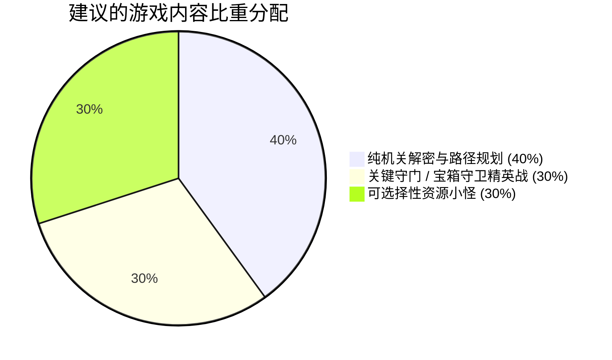

# 《Realmwand: The First Tower》Floor 1 ~ Floor 5 综合测评报告

---

## 报告总览与测评环境说明

- **测评对象**：主线地下城 1 至 5 层（Floor 1 ~ Floor 5 主通道与合法区域，排除无地块/墙体孤立废案）
- **测试工具与方式**：Godot 4.7 引擎实例 + `godot-mcp-pro` 自动化与人类输入模拟（真实按键事件驱动、射线探测、伤害结算与运行时截图捕获）
- **测评维度**：**游戏设计**、**数值设计**、**交互设计**、**代码实现**、**美术风格与视觉传达**五大维度，并针对**机关巧妙度与引导**、**怪物密度与难度**、**战斗与解密比重分配**进行专项深度解答。

---

## 一、五大维度深度测评

### 1. 游戏设计（Game Design）：关卡结构与主题递进

游戏整体采用 **“自下而上的主题递进式塔楼设计”**，每一层都有极为清晰的玩法主题与核心心流，结构设计非常扎实：

| 楼层 | 主题定位 | 核心机制与玩法设计 | 关卡心流与体验评价 |
| :--- | :--- | :--- | :--- |
| **Floor 1** | **启蒙教学**<br>（Tutorial & Basics） | • 初始 3×3 安全区，单开关开启通道<br>• 红/蓝双翼分支机关解锁顶端黄色区域<br>• 拾取 Lv1 手/胸/足三件基础装备并击败对应属性怪 | **优秀**。以红（攻）、蓝（速）、黄（防）三色区域直观建立属性认知，循序渐进地解锁生命、攻击、防御、速度四大面板属性。 |
| **Floor 2** | **属性专精**<br>（Growth & Specialization） | • 引入碎片兑换 NPC（`FragmentExchanger`），每 3 个碎片永久 +1 对应属性<br>• 大量血药/蓝药补给与 Lv2 装备拾取点 | **良好**。为玩家提供了属性构筑（Build）的雏形，但本层怪物分布较为密集，存在数值失控的严重数据 Bug（详见数值篇）。 |
| **Floor 3** | **规则迷宫**<br>（Movement Rule Puzzle） | • **核心规则**：**“只准直行与左拐，严禁右拐与掉头”**<br>• 违反规则立即触发警告并强制传回起点重置<br>• 终点到达 `StairUp` 解除规则限制 | **极具创意与惊艳感**。将单纯的走迷宫升华为**空间拓扑与朝向规划**的益智挑战，是 1~5 层中最具特色的纯机制解密层。 |
| **Floor 4** | **机制 Boss 战**<br>（Skill Check Boss） | • 单挑战：攻击之王（`BossAtk`）<br>• 核心机制：Boss 蓄力大招 `overflow`（湮灭，威力 150），玩家必须在读条期间使用 `kick_off`（踢击）精准打断<br>• 备战区提供 8 瓶大血药 | **紧张刺激**。成功实现了传统回合制中少有的“打断与时间轴博弈”操作感，是对玩家技能理解的一次大考。 |
| **Floor 5** | **复合抉择**<br>（Complex Dungeon & Builds） | • 红/蓝/黄/中立四重属性通道门与单向门（`OneWayPassage`）<br>• 动态旋转开关控制单向门朝向<br>• 三大流派导师 NPC：传授【过载攻击】/【过载防御】/【过载极速】（互斥遗忘机制） | **高水准箱庭解密**。将路线解密与流派技能终极抉择结合，完成了前 4 层机制的综合集大成。 |

---

### 2. 数值设计（Numerical Design）：公式模型与数据健康度

#### (1) 底层数学模型分析
- **伤害公式**：`Damage = max(1.0, atk * skill_power / def)`
  - **机制特性**：纯除法模型。防御力（DEF）具有非线性递减收益，但存在**硬性破防临界点**。
  - **实测表现**：
    - 在 1 级战斗中，玩家（40攻/40防）对 1 级平衡怪（20攻/28防）使用基础攻击（威力 40）：
      $$\text{玩家伤害} = \frac{40 \times 40}{28} \approx 57 \text{ 点}$$
      $$\text{怪物伤害} = \frac{20 \times 40}{40} = 20 \text{ 点}$$
    - 玩家 320 血量、怪物 200 血量，玩家需 4 回合斩杀，承受 60 点伤害（约 18.7% HP 损耗），新手期体验非常平稳。
- **衍生属性推导**：
  - $\text{Max HP} = (\text{def} + \text{spd}) \times 4$
  - $\text{Max MP} = (\text{atk} + \text{spd}) \times 2$
  - $\text{FP 回复速度} = (\text{atk} + \text{def}) \times 0.1$
  - **评价**：速度（SPD）同时参与 HP 与 MP 的衍生计算，且直接决定 ATB 读条速率（$\text{Time} = \frac{100}{\text{spd}}$），导致 **速度属性的综合收益过高（性价比之王）**，中后期容易出现堆速度碾压所有维度的倾向。

#### (2) ⚠️ 发现的严重数值失控与资源配置 Bug
在通过 MCP 全量解析游戏资源数据时，发现了以下**必须立即修复的数据缺陷**：

```
[严重致命] resources/actors/enemy_balance_lv2.tres
  - atk = 1000.0, def = 1000.0（推测为测试用脏数据未清理）
  - 影响：玩家在 Floor 2 遭遇该怪物会被一击造成 1000+ 伤害瞬间暴毙，无法通关。

[配置错误] resources/actors/enemy_spd_lv1.tres
  - id = &"enemy_def_lv1"（ID 复制粘贴错误，导致怪物 ID 冲突）

[属性缺失] resources/actors/enemy_atk_lv2.tres
  - 缺失 id 字段定义

[属性缺失] resources/actors/enemy_def_lv2.tres & enemy_spd_lv2.tres
  - 未配置 atk, def, spd，加载后全部使用缺省值 0，导致计算除以零或打怪伤害异常。

[技能冷却平衡] resources/skills/kick_off.tres
  - 配置为消耗 20 FP 与 4 回合冷却（COOLDOWN = 4），无吟唱时间（瞬发打断）。
  - 在 Boss 战中作为关键打断技能，4 回合 CD 与 20 FP 消耗可较好限制玩家滥用，但需注意 Boss 大招释放频次是否会快于 4 回合。
```

---

### 3. 交互设计（Interaction & UX）：操作手感与反馈

#### (1) 优秀体验点
- **移动平滑度**：网格移动（32px）配合 0.25s 的 Tween 插值，移动手感扎实，没有穿墙或卡格现象。
- **战斗即时信息预览（Combat Forecast）**：
  - 在选择技能时，系统不仅会高亮技能详情，还会**在敌方生命条上以红色直接预览本次技能造成的伤害区间（如 `200 (-57) / 200`）**；
  - 右侧面板实时展示敌方下一次行动的技能名称、类别、威力与消耗，信息透明度极高，博弈感很强。
- **循序渐进的引导教学**：
  - 战斗初期并未一股脑灌输复杂 UI，而是通过 `TutorialUI` 配合属性解锁，逐步点亮 HP、ATK、DEF、SPD，体验极佳。

#### (2) 亟待改进的交互痛点
- **远端机关缺乏视觉焦点引导（Camera Pan）**：
  - 当玩家在 Floor 1 或 Floor 5 踩下/扳动某个开关时，仅在左下角弹出 3 秒文本提示 `“某处的墙壁降下了。”`，玩家镜头并没有平移展示具体哪道门开了，导致在多路迷宫中玩家常常不知道发生了什么变化。
- **射线交互朝向判定严格**：
  - 玩家必须精确面向目标物体按下 `E`（`interact`）才能触发；如果仅从侧面撞向开关，无法自动触发。

---

### 4. 代码实现（Code Architecture & Quality）

- **数据驱动架构（Data-Driven）**：
  - 角色、技能、装备、消耗品全部使用 Godot 原生 `.tres`（Resource）定义，模块化程度高，符合现代游戏开发标准。
- **事件解耦（EventBus）**：
  - 战斗请求、场景切换、状态变更统一通过 `EventBus` 单例广播，各子系统之间无紧耦合。
- **动态快照系统（TileMap Snapshot）**：
  - `floor_1.gd` 等脚本采用 `capture_dynamic_wall()` 记录初始墙面坐标与 TileData，升降墙逻辑优雅清晰。
- **优化建议**：
  - 建议在 `GameData` 或数据加载入口加入 **Resource 校验断言（Validation Assert）**，在游戏启动时自动拦截 ID 重复、攻防值为 0 或 1000 等异常资源，防止低级配置错误流入生产环境。

---

### 5. 美术风格与视觉传达（Art Style & Visuals）

- **色彩语义清晰**：
  - 红色（攻击/火）、蓝色（速度/敏捷）、黄色（防御/生命/中立），地图地块与怪物颜色严格对齐，玩家一眼就能识别区域属性。
- **极简风格统一**：
  - 柴犬/火柴人主角与机械几何生物风格统一，UI 边框与暗色半透明面板排版精致耐看。
- **视觉动态感建议**：
  - 目前战斗中技能释放缺少命中震屏（Screen Shake）、受击闪白（Flash White）与粒子飘字，增加这些微反馈能使打击感大幅跃升。

---

## 二、专项核心问题解答

### Q1：机关设计的是不是巧妙？位置引导怎么样？

#### 1. 巧妙度评价：**8.5 / 10（极具巧思）**
- **Floor 1**：经典的“双翼开关解锁中央主道”设计，逻辑简单清晰，适合教学。
- **Floor 3（高光设计）**：**“只能前进与左转”** 的规则设计堪称惊艳。它打破了传统 RPG 迷宫单调的“找钥匙开门”套路，要求玩家在脑海中规划三维视角的旋转路径，趣味性和成就感拉满。
- **Floor 5（复杂箱庭）**：单向门配合旋转开关换向，构成了立体的网状解密通道，解密深度到位。

#### 2. 位置引导评价：**6.5 / 10（有待提升）**
- **优势**：地面瓦片颜色（红/蓝/黄）与门/怪物的对应关系非常清晰，颜色引导很成功。
- **痛点与改进方案**：
  1. **缺乏镜头转场引导**：当扳动远端开关时，建议加入一个 0.8 秒的镜头平移动画（Camera Tween），聚焦被开启的门，随后移回玩家；
  2. **缺少小地图/已探索标记**：在 Floor 5 复杂单向门迷宫中，容易发生迷路。

---

### Q2：怪物是不是太多了？太难了？

#### 1. 怪物数量与密度评估
- **Floor 1**：每翼 4 只怪（共 12 只），密度适中，击败守门怪后即可拿到装备和开关。
- **Floor 2 & Floor 3**：**密度偏高**。因为走道只有 1 格宽，怪物直接堵死在必经之路上，玩家**无法避战（不可绕行）**。在 Floor 3 中，玩家如果尝试路线解密失败被传回起点，中途如果怪物未击杀还会反复遇敌，容易产生疲劳感。

#### 2. 怪物难度评估
- **小怪战难度**：在修正 `enemy_balance_lv2` 1000 攻防 Bug 后，小怪数值曲线本身并不苛刻，只要玩家及时穿戴装备和消耗碎片强化，小怪 3~4 回合内即可击杀。
- **Boss 战（Floor 4）难度**：**机制严苛，容错率较低**。
  - Boss 大招 `overflow` 如果未被打断，可造成 100+ 伤害直接致死；
  - 打断技能 `kick_off` 为瞬发打断技能（4 回合冷却、20 FP 消耗），若玩家在 Boss 未蓄力时误放或 FP 不足，将无法在 Boss 读条时打断导致暴毙；
  - 建议将 Boss 大招蓄力时间（ATB 读条）适当放宽 0.5 秒，给玩家更充裕的反应窗口，并在战前提示中强调打断时机与 FP 保留。

---

### Q3：怪物战斗与机关解密的比重应该怎么安排？

针对地牢爬塔/箱庭解密 RPG，目前的**怪物与解密比重约为 6:4**（战斗偏多，解密常被强制战斗打断）。建议调整为 **“黄金 4:3:3” 结构**：



### 具体调优落地建议：

1. **解密心流保护（减少无效杂兵）**：
   - 迷宫中的核心解密区（如 Floor 3 的规则转向区、Floor 5 的单向门网络区），**不应在狭窄的关键拐角放置强制战斗怪物**，避免打断玩家的路径思考；
   - 怪物主要放置在 **“重要宝箱/高级装备守护位”** 或 **“通往下一层的终点守门位”**。
2. **引入“解密绕道”与“正面强攻”双路径**：
   - 玩家若解开巧妙机关，可以从侧方安全通道绕过强力怪物；
   - 玩家若不想动脑，也可以选择直接硬刚怪物强行突破（获得更多经验与碎片回报），形成“智力与武力”的双重正向反馈。
3. **增加脱离战斗与避战机制**：
   - 允许玩家在非 Boss 战中选择“撤退”，撤退后怪物短暂停顿 1~2 秒，给玩家退回安全格的缓冲时间。

---

## 三、测评结论与建议清单

《Realmwand: The First Tower》在核心架构、数据驱动规范、特色规则解密（如 3 层的方向约束）以及回合制 ATB 博弈（如 4 层的打断机制）上展现出了**极高水准的设计底子与可玩性潜力**。

### 优先修复与优化清单（Action Items）：
1. 立即修正 `resources/actors/enemy_balance_lv2.tres` 的 1000 攻防异常值；
2. 修复 `enemy_spd_lv1.tres` ID 冲突及 Lv2 怪物属性缺省问题；
3. 关注 Boss 大招与 `kick_off` 4 回合 CD 的时间轴对齐，确保玩家每轮大招均有打断机会；
4. 为远距离机关开启增加简短的 Camera Pan 焦点特写镜头；
5. 在 Floor 3 规则迷宫与 Floor 5 复杂单向门区适当减少杂兵密度，将重心集中在空间解密心流上。
