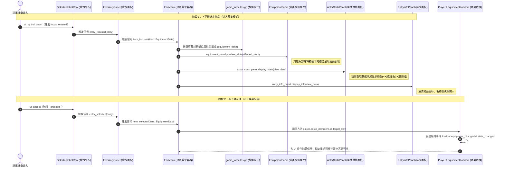
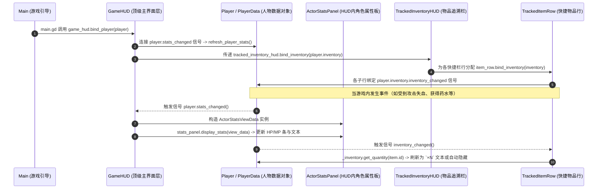

# Realmwand: The First Tower - UI 体系与架构设计文档

本文档详细解析 **Realmwand: The First Tower** 项目中的 UI 组件架构、目录/层级映射关系、通信与调用模式，以及核心交互的端到端时序。旨在为后续的界面迭代、重构与新组件扩展提供一致的行为准则。

---

## 1. 整体架构思想与设计原则

本项目严格遵守 **“场景为根基（Scene-First）”** 与 **“数据驱动（Data-Driven）”** 的设计理念：

1. **场景可视化闭环**：每个独立的 UI 面板、子层级或弹窗都必须作为独立场景（`.tscn`）存在，并且能在 Godot 编辑器中**单独可视化编辑与运行预览**。禁止通过纯脚本在运行时硬写拼接 UI DOM 树。
2. **职责分离（MVC/MVVM 模型映射）**：
   - **表现层（View - `scenes/ui/*.tscn`）**：定义页面结构、节点嵌套关系（如 `PanelContainer`、`MarginContainer`、`VBoxContainer`）、字体/边距规范及各种布局锚点（Anchors）。
   - **控制与逻辑层（Controller - `scripts/ui/*.gd`）**：通过 `@onready` 绑定页面内部的关键视图节点，监听用户键盘方向键/输入导航，并对外提供简洁的统一方法和事件信号。
   - **视图数据层（ViewData DTO - `*view_data.gd`）**：为解耦复杂的领域模型（如 `Player`、`ItemData`、`SkillData`），通过 `ActorStatsViewData`、`EntryInfoViewData` 等轻量级数据传输对象（DTO），向 UI 呈现只读且已规格化的显示数据。
3. **非侵入式数据处理**：UI 仅承载信息的渲染与用户输入的意图转发，**严禁直接修改游戏核心领域模型或将其状态写回共享的 `.tres` 资源**；所有持久状态变更均通过调用玩家或业务系统对外暴露的接口完成。

---

## 2. `scenes/ui` 与 `scripts/ui` 的层级关系与映射

在项目中，UI 系统被划分为四个**顶层叠加页面（Overlay Layer）**和多个**可复用子组件（Reusable Components）**。`scenes/ui/` 下的每个 `.tscn` 文件，在根节点上均挂载由 `scripts/ui/` 或相应业务目录下命名的同名 `.gd` 脚本。

### 2.1 目录结构对比图谱

```text
scenes/                                  scripts/
├── ui/                                  ├── ui/
│   ├── game_hud.tscn           ◄──────► │   ├── game_hud.gd
│   ├── esc_menu.tscn           ◄──────► │   ├── esc_menu.gd
│   ├── components/                      │   ├── components/
│   │   ├── actor_stats_panel.tscn ◄───► │   │   ├── actor_stats_panel.gd
│   │   │                                │   │   ├── actor_stats_view_data.gd   (纯脚本 ViewData DTO)
│   │   ├── inventory_panel.tscn   ◄───► │   │   ├── inventory_panel.gd
│   │   ├── skill_panel.tscn       ◄───► │   │   ├── skill_panel.gd
│   │   ├── equipment_panel.tscn   ◄───► │   │   ├── equipment_panel.gd
│   │   ├── entry_info_panel.tscn  ◄───► │   │   ├── entry_info_panel.gd
│   │   │                                │   │   ├── entry_info_view_data.gd    (纯脚本 ViewData DTO)
│   │   ├── selectable_list_row.tscn◄──► │   │   ├── selectable_list_row.gd
│   │   ├── tracked_inventory_hud.tscn◄─►│   │   ├── tracked_inventory_hud.gd
│   │   ├── tracked_item_row.tscn  ◄───► │   │   ├── tracked_item_row.gd
│   │   ├── game_message_panel.tscn◄───► │   │   ├── game_message_panel.gd
│   │   └── player_stat_hud.tscn   ◄───► │   │   └── player_stat_hud.gd
│   └── progression/                     │   ├── progression/
│       └── level_up_ui.tscn       ◄───► │   │   └── level_up_ui.gd
├── battle/                              │   ├── battle/
│   └── battle_ui.tscn             ◄───► │   │   └── battle_ui.gd
```

### 2.2 树状组合与层级嵌套关系

`scenes/ui/` 与 `scripts/ui/` 之间的层级结构体现为**树状递归组合（Composition Tree）**：顶层 `CanvasLayer` 场景将可复用子组件（`components/`）实例化为自己的子节点；每个子节点组件不仅对内封装布局和 UI 控制，同时也提供了强类型的脚本编程接口。

```text
顶层 UI 容器 (CanvasLayer)                子组件实例 (Control / PanelContainer)
┌─────────────────────────────────┐
│ EscMenu / BattleUI / GameHUD    │
│  - 响应整体展开/隐藏              │
│  - 管理多页签焦点路由              │
│  - 持有并协调各个 UI 子组件         │
└────────────────┬────────────────┘
                 │ (组合 @onready 实例化)
                 ▼
┌────────────────────────────────────────────────────────────────────────┐
│ Reusable Components (scenes/ui/components & scripts/ui/components)     │
├────────────────────────────────┬───────────────────────────────────────┤
│ ActorStatsPanel                │ 展示名称/肖像/等级/HP/MP/FP/ATK/DEF/SPD│
│ EquipmentPanel                 │ 渲染 9 个装备槽位状态与装备位替换预览       │
│ EntryInfoPanel                 │ 呈现选中的物品/技能图标、简介与详细属性     │
│ InventoryPanel                 │ 动态拉取库存列表，管理分类筛选与列表光标     │
│ SkillPanel                     │ 动态加载学习到的技能表并提供列表导航       │
└────────────────────────────────┴───────────────────────────────────────┘
                 │ (@export row_scene 动态实例化子元素)
                 ▼
┌────────────────────────────────────────────────────────────────────────┐
│ List Rows / Leaf Components                                            │
├────────────────────────────────┬───────────────────────────────────────┤
│ SelectableListRow              │ 通用单行控件 (支持 entry_focused / selected)│
│ TrackedItemRow                 │ HUD 快捷追踪物品展示行                   │
└────────────────────────────────┴───────────────────────────────────────┘
```

---

## 3. 各个 UI Component 之间的核心调用模式

UI 组件之间的互相调用非单一粗暴的直接函数互调，而是基于高内聚、低耦合的原则，分为以下**四种通信与控制模式**：

### 3.1 模式一：自上而下的方法调用 (Top-Down Direct Method Calls)

在场景节点树中，**父 UI 组件持有对子 UI 组件的引用**（通过 `@onready` 获取节点），并且只能由**父节点主动调用子节点暴露的公开方法**来传入配置或渲染命令。
- **调用规则**：父知道子，子永远不知道父是谁（禁止向上传递调用 `get_parent()`）。
- **典型实现**：
  - `EscMenu` → 调用 `inventory_panel.bind_inventory(_player.inventory)` 绑定玩家背包数据。
  - `EscMenu` → 调用 `equipment_panel.preview_slots(affected)` 将右侧将要替换的槽位高亮。
  - `GameHUD` → 调用 `actor_stats_panel.display_stats(view_data)` 更新主屏幕左侧的角色统计。

### 3.2 模式二：自下而上的信号抛出 (Bottom-Up Signal Emission)

当用户在界面中进行焦点切变（方向键上下浏览列表）或按键选择（回车 / 点击确立选项）时，由底层 UI 元素或列表控件捕获硬件输入，随后通过 **Godot 信号（Signal）** 自底向上层层向外部通知。
- **调用规则**：子层级只负责表达“某事件已发生”，不决定该事件会产生什么玩法逻辑。
- **典型实现**：
  - `SelectableListRow` 监听并处理按钮的 `focus_entered` 与 `pressed` 事件，转而向其父容器发散 `entry_focused(resource)` / `entry_selected(resource)`。
  - `InventoryPanel` 监听各单行的上述信号后，归一化输出信号为：
    ```gdscript
    signal item_selected(item: ItemData)
    signal item_focused(item: ItemData)
    ```
  - `EscMenu` 订阅到 `inventory_panel.item_focused` 后，在其回调函数 `_on_item_focused(item: ItemData)` 中进行复杂的调度（统一刷新属性预览面板和说明文档）。

### 3.3 模式三：基于信号订阅的数据绑定 (Data-to-UI Bind & Signal Subscription)

UI 组件需要能够响应后台数据结构的自发改变（例如角色受伤、穿上装备或消耗品减少）。为避免主循环无歇轮询，本项目使用**数据绑定与信号监听机制**。
- **典型实现**：
  - **角色数值订阅**：`GameHUD` 提供了 `bind_player(player)`。函数内部会将 `player.stats_changed` 信号绑定至回调函数 `refresh_player_stats`。无论是因为战斗扣血还是吃药回血，都会第一时间重绘血条。
  - **库存变动订阅**：`InventoryPanel.bind_inventory(inventory)` 通过监听 `inventory.inventory_changed` 信号；只要发生增删物品，便自动销毁旧的列表行 `SelectableListRow` 并按照筛选类别与排序规则重建节点树。
  - **装备槽变动订阅**：`EquipmentPanel.bind_loadout(loadout)` 响应 `loadout.equipment_changed` 信号，负责即时更新 9 大装备槽口的文本与图标样式。

### 3.4 模式四：中介者与管理器控制 (Mediator & Manager Control)

顶层场景 `Main` 充当所有顶级界面之间可见性与事件调度的“总控制中心”；同时由具体的业务系统控制器（如 `BattleManager`、`LevelUpManager`）对 UI 进行功能关联。
- **核心路由**：
  - `Main._unhandled_input()`：检测系统菜单按键（`toggle_menu` / ESC）。若检测到当前正在战斗（`battle_manager.is_active()`）或正在升级（`level_up_manager.is_active()`），则拦截操作不打开主暂停菜单，仅在常态下调用 `esc_menu.toggle()`。
  - **模块化绑定**：
    - `BattleManager.setup(player, battle_ui)` 将 `BattleUI` 传入；进入玩家回合时调用 `battle_ui.open(player, enemy)` 并赋予其输入焦点。
    - `LevelUpManager.setup(player, level_up_ui)` 把 `LevelUpUI` 与加点操作绑定；当玩家等级升级就绪时调启 UI 交互。

---

## 4. 典型端到端 UI 交互时序精讲

为了更具象地说明各组件在运行中是如何配合工作的，以下提供两类高频业务场景的核心交互时序分析：

### 4.1 案例一：在 ESC 菜单中，光标移动并选定一件要穿戴的装备 (Equip Preview & Selection Flow)

在该流程中，用户输入通过组件子树传往事件汇编中心 `EscMenu`，由 `EscMenu` 协调多个并列组件展示“换装前/换装后”的效果预测，并完成真正的装备变更。



#### 关键实现解析：
1. **统一预览计算**：`EscMenu` 不包含底层公式，而是向 `FORMULAS.equipment_delta(...)`（定义于 `scripts/shared/game_formulas.gd`）传入当前待选装备以及将被卸下的原有装备数组，以此算出准确的属性 Delta 字典。
2. **视图解耦传输**：`EscMenu` 内部利用计算后的数值组装一个 `ActorStatsViewData` 对象，通过属性 `.max_hp_delta`, `.atk_delta` 对其进行显式赋值，并交给 `ActorStatsPanel.display_stats()`，面板自行解析应以哪种样式及颜色（预设常量 `PREVIEW_GAIN_COLOR` 和 `PREVIEW_LOSS_COLOR`）来渲染提示。

---

### 4.2 案例二：主界面 HUD 与角色属性同步响应 (HUD Real-time Synchronous Flow)

无论界面当前处于探索跑图阶段还是处于激烈战斗中，`GameHUD` 永远作为被动同步者，通过信号链条对外界的属性及库存更迭做出响应。



---

## 5. UI 开发与拓展标准规范 (Development Rules & Best Practices)

为确保项目从早期开发阶段持续演进时的结构整洁，后期的所有 UI 需求与迭代变更均需遵守以下要求：

1. **统一组件化架构**：
   - 任何涉及统计展示、属性行、信息详细面板或交互选单的模块，**首选使用和拓展 `scenes/ui/components/` 下的原有基础场景**（如 `ActorStatsPanel` / `EntryInfoPanel` 等）。
   - 若新增通用组合 UI 模块，必须先作为新 `.tscn` 添加至 `scenes/ui/components/` 目录中，再在顶层页面场景中使用实例化进行装配。
2. **颜色规范与集中管理**：
   - UI 脚本代码中如需改变特定样式着色，严禁使用含糊且非规范的内置颜色命名（如 `Color.RED`、`Color.GREEN`），而需**必须使用十六进制字符串声明的规范形式**：
     ```gdscript
     const PREVIEW_LOSS_COLOR := Color("#FF4155FF")
     const PREVIEW_GAIN_COLOR := Color("#32FF7DFF")
     ```
3. **完全采用全键盘/全手柄无障碍焦点导航**：
   - 项目以方向键与确认键输入作为控制核心。所有新增单选列表/表格或交互按钮，必须在 `_ready()` 阶段配置合适的焦点模式（例如 `focus_mode = Control.FOCUS_ALL`），并正确维护焦点进出监听事件（`focus_entered`），保证在无需光标参与下也能顺滑交互。
4. **纯数值逻辑与 UI 分离开发**：
   - 界面上如果遇到增量预测、经验值百分比算数或治疗恢复预估等要求，**严禁将数学计算写散落在各个 UI 脚本中**，统一定义并在 `scripts/shared/game_formulas.gd` （即 `FORMULAS` 静态单例方法库）内实现。
